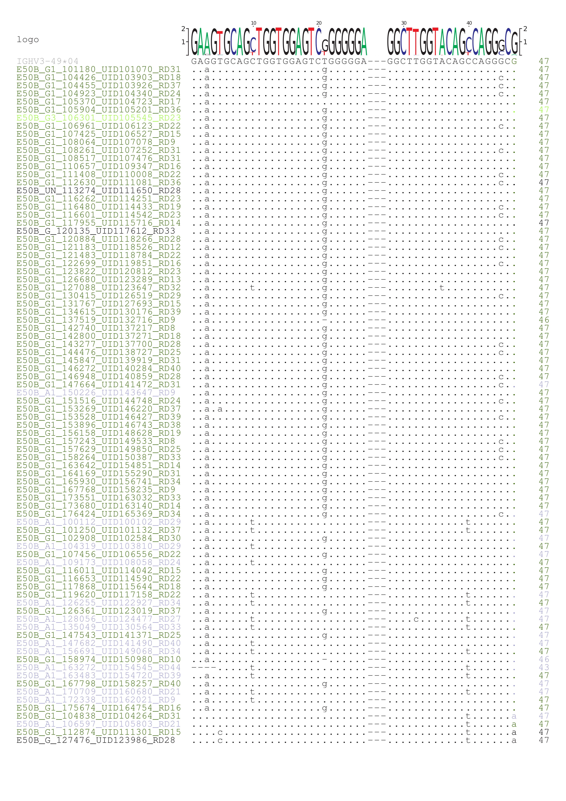

\fontsize{10}{10}
<style>
body {
text-align: justify}
</style>
```{r setup, include = FALSE}
knitr::opts_chunk$set(
  collapse = TRUE,
  comment = "#>"
)
knitr::opts_knit$set(
  root.dir = "~/"
)
```

# Phylogeny for B cell clones
The immune system has a plethora of naive B cells ready at any given time to respond to a new challenge. The receptor on the surface of the B cell that recognises a target antigen is known as a B cell receptor (BCR) and is encoded by immunoglobulin genes. The same genes are used to produce secreted antibody by terminally differentiated B cells. Immunoglobulin heavy chains have a Variable region, conferring antigen specificity, and a constant region, conferring functionality. A few B cells will interact with a newly presented epitope (e.g. on the surface of a virus particle) and become activated. Upon activation, these cells proliferate and undergo *affinity maturation* to further enhance their affinity and specificity for the given target. During this, the DNA sequences of the Variable region (mainly the CDRs) will be mutated and starting from one precusor B cell, a *clone* will emerge with sequence variations. These clones can be clustered [^clonotype_clustering] by comparing CDR3 sequences, since the diversity of Variable regions is so high that a particular CDR3 region is a fingerprint that can be used to identify lineages. However, in order to infer the relationship between observations, phylogenetic analysis has to be done. The final products of this vignette are phylogenetic and arborescence trees [@mesbahimehran_graph_2010] for a set of clones. We also implemented tree metrics to summarise their topologies to facilitate comparisons of a large number of clones.

[^clonotype_clustering]: This can be done in various ways. The in-house package `BrepClustering` implements our own technique based on clustering (heavy chain-derived) sequences using a user-specified threshold and the Levenshtein distance. Users can nevertheless use their preferred clonotype clustering method - our input formats are flexible and expect only a input table with clone identifiers as one of the columns.

## Class switching
Clones are usually established by considering the variable region, but immunoglobulins can also switch their (sub-)class during maturation. Effectively, this means the exchange of the constant region of an antibody to allow for a different effector function. Currently, it is thought that this exchange has no impact on the binding affinity / specificity of the Variable region; however these class-switching events are nevertheless important to consider as they would affect e.g. the efficacy of invoking downstream signaling. A noteworthy restriction of class-switching is its directionality: mechanistically it involves excisions of DNA segments from the genome which leads to an ever decreasing pool of potential (sub-)classes. It is the order of the constant region genes that determines whether a suspected transition is genetically possible, e.g. A1 -> G2, G2 -> E and D -> A1 are possible, while A1 -> G1 is not. The ordering used in this R package to assess validity is for the human genome as follows: germline -> M -> D -> G3 -> G1 -> A1 -> G2 -> G4 -> E -> A2. While not part of the phylogenetic tree reconstruction (see explanation below), this is a crucial constraint in the construction of an arborescence tree. Also note that unlike other cases of phylogenetic reconstruction, here we are in the rare position to properly identify a "true" root, the germline sequence - a piece of information, that can be included if available.

# Building a phylogenetic tree for a B cell clone
The following example assumes, that clonotype clustering has already been performed and unique identifiers are given in column `CloneID` (observations with the same integer number are considered part of the same clone). The observations can be labelled, both by colour (here, the (sub-)class stated in column `Subclass`) and by the tip-label (here, the sequence identifier in column `Seq_ID`). The latter is optional. Column `V.GENE.and.allele` is used to identify the original germline (as annotated by [IMGT V-QUEST](http://www.imgt.org/IMGTindex/V-QUEST.php) [@brochet_imgt_v-quest_2008]): For IMGT, the germline sequences for several species have been in-built into this package and can be readily used within this workflow.

## Load data

```{r, eval = TRUE, message = FALSE}
# load the necessary packages
library( BrepPhylo )

# load the example input data frame
input <- read.csv( system.file( "extdata/input.csv",
                                package = "BrepPhylo" ) )

# select only the columns that are needed
input <- input[ , c( "PatientID", "Class", "Subclass",
                     "CloneID", "Seq_ID", "UseAsRef",
                     "Vgene", "V_gapped" ) ]
# 'V_gapped' is the gapped VDJ DNA sequence
```

```{r, eval = TRUE, message = TRUE}
# print structure
str( input )

# print first rows (without the sequence)
tibble::as_tibble( head( input ) )

# print (sub-)classes of clone 3 of patient CV233
print( unique( input[ input[ , "CloneID" ] == 3 & input[, "PatientID"] == "CV233",
                      "Subclass" ] ) )
```

In this example, it is evident that the members of clone 3 of patient CV233 show three sub-classes, namely "IgM", "IgG1" and "IgG2".

## Construct phylogenetic trees and PDF alignments for selected clones

Function `cloneLineage` takes a clone and constructs a phylogenetic tree from it. Internally, a distance matrix is constructed. There are two options available (in this package) on how to estimate the distances between observations (sequences): Either using a "simple" (standard exchanges) or a more sophisticated model that has been optimized for the use in B cell lineages, implemented in the [IgPhyML program](http://evolve.zoo.ox.ac.uk/Evolve/IgPhyML.html) [@hoehn_phylogenetic_2017]. For `IgPhyML`, three levels of accuracy can be specified (see manual page of function `IgPhyML`).

### Sequence format and germline database

We support either ungapped version of VDJ sequences, or a gapped version provided from IMGT/V-Quest. Tree inference requires identification of a germline sequence as root. We offer flexibility depending on the data you are working with:

* By default, our package provides databases of *both* gapped and ungapped germline sequence for the following species: `Humans, Bos_taurus, Gallus_gallus, Mus_musculus, Oryctolagus_cuniculus, Sus_scrofa`. You can specify your species in the parameter `species` in calling `cloneLineage()`.
* If you work on other species, and/or you would like to use a germline sequence set of your choice, you can pass the FASTA file containing such sequences using the parameter `germlineSet` in calling `cloneLineage()`. If you opt for this option, remember the germline sequence set **must** match VDJ sequences in the submitted data frame in terms of gapping. If e.g. the VDJ sequences are IMGT-gapped but the germline sequence set is not, the function will return an error message. IMGT germline sequences can easily be downloaded from the IMGT website ([IMGT/Gene-DB](http://www.imgt.org/genedb/) for flexible selection of sequence sets, or [IMGT reference directory](http://www.imgt.org/download/V-QUEST/) for IMGT-gapped sequences for each gene locus of a given species). 
* Please note that the parameter `species` needs to match the naming system in the germline sequence set. If you use the default in-built germlines, please refer to the first point for allowed species names. If you use your own germline sequence set, sequences downloaded from IMGT are named by the binomial nomenclature (i.e. "Homo sapiens", "Mus musculus" etc. - notice space instead of "_") - this should be specified in the `species` argument. 

Germline sequence will be selected for each clone automatically by taking the allele annotated for most of the sequences in the given clone.

### Expected output
The `cloneLineage()` function generates the following files in a specified folder, where "ID" is the clone ID and "X" denotes the parts of the alignment (in case it exceeds more than maximum of 80 sequences):

* One folder called "clone_ID" for every clone considered, including:

  + File "clone_ID.csv", holding the observations comprising the clone (i.e. an excerpt of the input data frame).
  + File "clone_ID.fasta", holding the multiple sequence alignment (including the chosen germline sequence) of the clone.
  + File "clone_ID.log", a comprehensive log file describing the steps of the process.
  + File "clone_ID.png", a PNG of the resulting tree.
  + File "clone_ID.tree", the generated tree in Newick format.
  + File "clone_ID_IgPhyML_fit.stats", holding the output of the fitting step in the tree generation using function `IgPhyML` (only if used).
  + File(s) "clone_ID_part_X.pdf", reporting the multiple sequence alignment in PDF format (optional).
  
* A folder called "plots", which holds a copy of all the tree pictures generated.
* File "colour_code.csv", which holds the colour code used in the pictures and alignments.
* File "parameters.log", holding the parameter values for the call of function `cloneLineage()`.

```{r, eval = TRUE, message = FALSE}
# specify a set of the three largest clones for illustrative purposes
vecClones <- c( "180",  # 416 members
                "186",  # 162 members
                "188" ) #  88 members

# generate an output folder on the desktop
# note, that a temporary folder might do just as fine
outputFolder <- path.expand( "~/Desktop/cloneLineage" )
dir.create( outputFolder, showWarnings = FALSE )

# run the tree reconstruction
cloneLineage( input = input,
              outputFolder = outputFolder,
              species = "Humans",
              whichClones = vecClones,
              colourSpecification = list( colours = list( "M" = "#FF0000",
                                                          "D" = "#FF00FF",
                                                          "IgA1" = "#9999CF",
                                                          "IgA2" = "#000088",
                                                          "IgG1" = "#326600",
                                                          "IgG2" = "#58B200",
                                                          "IgG3" = "#8BFF19",
                                                          "IgG4" = "#CBFF99" ),
                                          coloursColumn = "Subclass",
                                          germlineColour = "#AAAAAA" ),
              sequenceColumn = "sequence_alignment",
              cloneIdColumn = "CloneID",
              germlineIdColumn = "V.GENE.and.allele",
              labelColumn = "Seq_ID",
              treeConstruction = list( "type" = "simple" ),
              makeAlignmentPDFConstruction = list( "makeAlignmentPDF" = TRUE ) )
```

```{r, echo = FALSE, fig.cap = "Clone 188, 88 members, phylogenetic tree (simple model)", out.width = "100%"}
knitr::include_graphics( paste0( path.expand( "~/Desktop/cloneLineage" ), "/clone_188/clone_188.png" ) )
```



### Use IgPhyML for tree inference
In general, it is recommended to use function `IgPhyML` to generate the trees. However, this can be very costly (see below). Nevertheless, this implements codon-specific substitution model aware of mutational preferences in somatic hypermutation, therefore it is preferred for phylogenetic inferences for B-cell repertoire data.

```{r, eval = TRUE, message = FALSE}
# generate an output folder
outputFolder <- path.expand( "~/Desktop/IgPhyML" )
dir.create( outputFolder, showWarnings = FALSE )

# run the tree reconstruction
 cloneLineage( input = input,
               outputFolder = outputFolder,
               species = "Humans",
               whichClones = "188",
               colourSpecification = list( colours = list( "M" = "#FF0000",
                                                           "D" = "#FF00FF",
                                                           "IgA1" = "#9999CF",
                                                           "IgA2" = "#000088",
                                                           "IgG1" = "#326600",
                                                           "IgG2" = "#58B200",
                                                           "IgG3" = "#8BFF19",
                                                           "IgG4" = "#CBFF99" ),
                                           coloursColumn = "Subclass",
                                           germlineColour = "#AAAAAA" ),
               sequenceColumn = "sequence_alignment",
               cloneIdColumn = "CloneID",
               germlineIdColumn = "V.GENE.and.allele",
               labelColumn = "Seq_ID",
               treeConstruction = list( "type" = "igphyml",
                                        "parameters" = list( "accuracy" = "basic") ),
               makeAlignmentPDFConstruction = list( "makeAlignmentPDF" = TRUE ) )
```

Note, that `IgPhyML` has two important restrictions on the input data:

+ The sequences must contain full codons (i.e. the overall number of nucleic acids needs to be an integer multiple of 3). This is required, as the different weights for the positions are taken into account (rather than using "just" inter-sequence distances measures in a naive model).
+ In addition, STOP codons are not allowed.

If gapped VDJ sequences are submitted, sequences will be processed obeying the IMGT gaps. If ungapped sequences are submitted, ClustalOmega will be called to generate a multiple sequence alignment of the given clone with the assigned germline. 

If sequences are not compliant with the length requirement, the last `x` residues are are cut off prior to the calculation. One STOP codon is allowed (and will be removed), but more than that lead to the exclusion of this sequence from the workflow. Thus, it can happen that not all observations are present in all analysis tasks using `IgPhyML`. This could be improved. Also, it is imperative that the sequences that are fed into `IgPhyML` are compliant with the program's expectations.

```{r, echo = FALSE, fig.cap = "Clone 188, 88 members, phylogenetic tree (using function `IgPhyML()`, accuracy set to `basic`)", out.width = "100%"}
knitr::include_graphics( paste0( path.expand( "~/Desktop/IgPhyML" ), "/clone_188/clone_188.png" ) )
```

## Construct an arborescence tree for a B cell clone
The phylogenetic tree built above does not allow directly to infer class-switching events, as the internal nodes are unknown (and thus, their class). However, function `cloneArborescence` calculates an arborescence tree which makes that possible. Here, we consider the phylogenetic tree as a directed network, and generates a [minimum spanning tree](https://en.wikipedia.org/wiki/Minimum_spanning_tree) starting from the germline sequence. Using [Edmonds' algorithm](https://en.wikipedia.org/wiki/Edmonds%27_algorithm), a tree is built satisfying the following requirements: (i) it obeys genetic plausibility (see above), (ii) the germline is set to be the true root node, (iii) all (directed) edges lead away from the root and (iv) a node has only one parent node. This approach has several weaknesses, most critically it places observations at internal nodes although a full coverage is highly unlikely. Nonetheless, if one is mostly interested in the number of class-switching events and the distribution of observations, this approach allows to investigate that in an easy and straight-forward manner. The calculation in this example is based on the distances from the tree calculations above.

This function generates the following artefacts in a specified output folder, where "ID" is the clone ID:

* File "clone_ID.arbo", a data frame with the edges of the arborescence tree and their weights.
* File "clone_ID_arbo.png", a picture of the arborescence tree.

```{r, eval = TRUE, message = FALSE, warning=FALSE}
# generate an output folder
outputFolder <- path.expand( "~/Desktop/IgPhyML/arborescence" )
dir.create( outputFolder, showWarnings = FALSE )

# execute it for clone 188
# read in the clone and the tree
clone <- read.csv( path.expand( "~/Desktop/IgPhyML/clone_188/clone_188.csv" ) )
tree <- "~/Desktop/IgPhyML/clone_188/clone_188.tree"

# calculate the arborescence for clone 188
arborescence <- cloneArborescence( clone = clone,
                                   cloneID = "188",
                                   columnSeqID = "Seq_ID",
                                   columnSubclass = "Subclass",
                                   tree = tree,
                                   outputFolder = outputFolder )
```

```{r, echo = FALSE, fig.cap = "Clone 188, 53 members, arborescence tree (simple model)", out.width = "100%"}
knitr::include_graphics( paste0( path.expand( "~/Desktop/IgPhyML" ), "/arborescence/clone_188_arbo.png" ) )
```

This arborescence lineage can also be visualised in a plot by ordering the nodes (i.e. sequences) by their distance from the root, groupng them by their ancestors in the graph, and plotting the subclass distribution across the distance-from-root axis:

```{r, fig.cap = "Clone 188 arborescence tree visualised as a 'lineage plot' highlighting emergence of sequences of different isotypes."}
arborescence$lineage_plot + cowplot::theme_cowplot()
```

With this plot we can easily trace the evolution of class-switching in the clone (narrow "tips" from left to right).

The class-switching events are listed in the `csr_events` element in the `cloneArborescence()` output:

```{r}
arborescence$csr_events
```

All of these could be traced on the lineage plot above. Note that the `distFromGermline` refers to the point this event is estimated to occur, *not* the point where a sub-lineage expands (widening of coloured bands vertically).

# Metrics to compare tree topologies

The functions above can be easily applied to generate trees for a large number of clones. It is difficult to do comparisons relying only on visual inspection of the trees. The `getTreeStats()` function quantifies a number of metrics to summarise different aspects of the topologies of a given tree. Numerous packages (e.g. [`partis`](https://github.com/psathyrella/partis) and [`alakazam`](https://alakazam.readthedocs.io/en/stable/)) has implemented methods to calculate, given a phylogenetic tree, a number of metrics. These packages focus on node-specific (i.e. specific to each sequence in the clone) measures; we based our implementation on functions available on the `alakazam` package and calculate these tree-centric metrics (in brackets are the name of the column[s] of the output data frame which holds these metrics):

* clone size (`clone_size`)
* number of internal nodes (`n_internal`)
* trunk length (ie distance from root to closest ["first"] split node) (`trunk_length`)
* root degree *normalised by the total number of edges in the tree* (`root_degree`)
* out-degree *normalised by the total number of edges in the tree*  - min, max, mean (`outdegree_*`)
* path length (ie distance from root) - min, max, mean (`dist_from_root_*`)
* distance between split nodes - min, max, mean (`dist_btwn_splits_*`)
* distance from root to split nodes - min, max, mean (`dist_root_to_splits_*`)
* distance from leaf to "first" split node - min, max, mean (`dist_from_first_split_*`)
* distance from leaf to nearest split node - min, max, mean (`dist_from_nearest_split_*`)
* size of sub-tree rooted on internal nodes *normalised by the total tree size* - min, max, mean (`size_subtrees_*`)

As you can see, a number of node-centric measures are included and converted to be tree-centric by considering summary statistics of their distributions (min, max, mean). Additionally, if IgPhyML analysis has already been performed on the clone of interest, parameters estimated by the IgPhyML model fit can be parsed into this function and these following parameters will be directly extracted and reported:

* total tree length (i.e. sum of the lengths of *all* edges in the tree) (`total_tree_length`)
* ts/tv, i.e. transition-vs-transversion ratio (`ts_tv`)
* dN/dS, i.e. nonsynonymous-vs-synonymous / replacement-vs-silent ratio (`dn_ds`)
* mutability for the following motives: hotspots (WRC, GYW, WA, TW) and coldspots (SYC, GRS) (`h_*`)

Note that the default IgPhyML run *did not* partition sequences into FWR and CDR portions; as a result separate dN/dS estimates for the two regions are not available. Doing so would require instruction to IgPhyML as to how to partition each sequence in the repertoire. At the moment this is not supported in the `cloneLineage` call.

**Important**: the minimum input to `getTreeStats` is *either* a conventional lineage tree (estimated using the 'simple' method above, or using IgPhyML or other phylogenetic reconstruction methods) or an arborescence tree generated using `cloneArborescence`. Please note that these methods generate trees of different natures and this has implications on the utility of these tree metrics. For example, an arborescence tree does not have internal nodes, and split nodes are themselves observed sequences rather than common ancestors absent from the sampled repertoire. On the other hand, conventional phylogenetic trees always connect pairwise observations, be it an internal node or a 'leaf' (i.e. observed sequences in this case) - this will imply out-degrees of nodes in such trees to be any one of 0 (the leafs), 1 (the germline to the first split internal node) or 2 (any split nodes). These differences need to be taken into account. 

For these reasons, we suggest passing information from *both* the phylogenetic and the arborescence trees to obtain meaningful tree statistics. By default, the following metrics are returned from each type of tree input:

* Conventional phylogenetic trees: clone size, number of internal nodes, total tree length, trunk length, path length, size of subtrees, and all distance-based measures listed above
* IgPhyML model fits: ts/tv, dn/ds, motif mutabilities
* Arborescence tree: clone size, all degree-based measures listed above

```{r getTreeStat}
getTreeStats( cloneID = "188", 
              phylo_tree = "~/Desktop/IgPhyML/clone_188/clone_188.tree",
              arbo_tree = arborescence$graph, 
              fit_stats = "~/Desktop/IgPhyML/clone_188/clone_188_IgPhyML_fit.stats",
              germline = "IGHV3-49*04" )
```

As one would intuitively expect, some of these features are correlated with one another. The following plots the Spearman correlation between these tree metrics calculated from clones identified from the B-cell repertoire of one individual:


Based on this we selected the following metrics as a 'core' set of metrics to be reported:

If only these 'core' metrics are desired, please specify `coreMetricsOnly = TRUE` when you call `getTreeStat`.

# Appendix


# Bibliography
